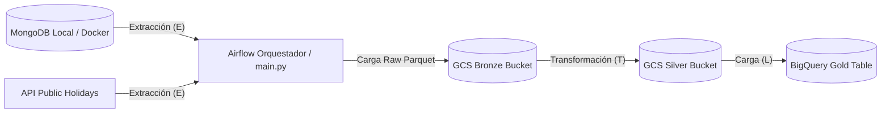

# Diagrama de arquitectura del Pipeline

# Decisiones de diseño
## 1. Apache AirFlow y main.py como orquestadores
**Decisión:** Usar tanto Apache Airflow como un archivo .py como orquestadores.  
**Justificación:**
- Por tema didácticos es importante saber orquestar con ambas opciones ya que un ingeniero de datos debe de tener varias opciones.
- Un orquestador main.py nos da mayor flexibilidad de la hora de imprimir en consola y de esta forma imprimir el flujo conforme avanza el pipeline.
- Apache Airflow permite orquestar, monitorear y visualizar el avance en tiempo real desde su UI.

## 2. MongoDB y API como fuentes de datos
**Decisión:** Usar tanto MongoDB como una API como fuentes de información.  
**Justificación:**
- En proyectos reales será importante leer información de diferentes fuentes.
- Saber manejar BD no relacionales como APIs, le da al ingeniero de datos más herramientas para desarrollar mejores pipelines de datos.

## 3. Nube GCP
**Decisión:** Se utilizó la nube de GCP.  
**Justificación:**
- Es la nube con la que cuento con mayor experiencia y puedo desarrollar un mejor pipeline.