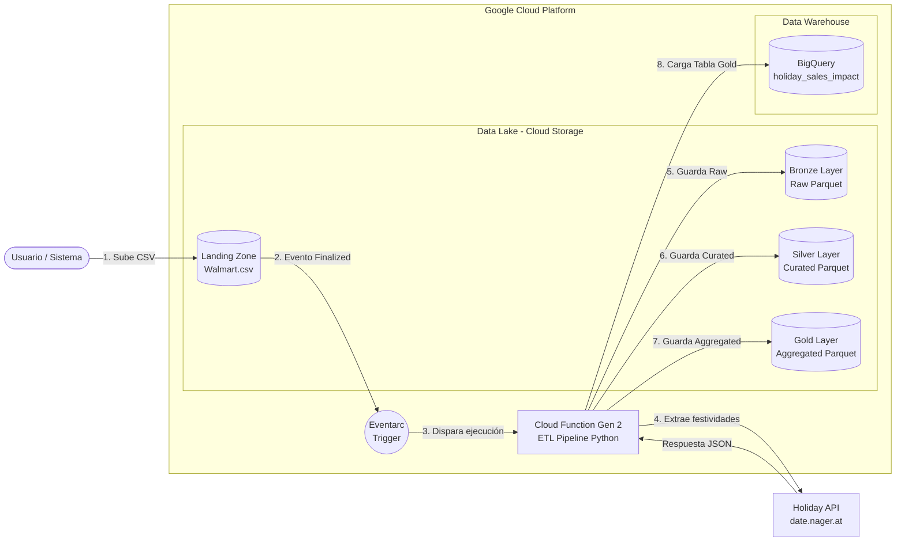

# Diagrama de arquitectura del Pipeline

# Decisiones de diseño
## 1. Eventarc como orquestador
**Decisión:** Usar Eventarc como orquestador.  
**Justificación:**
- Permite la detección de eventos y orquestar un flujo con base a esta acción (en este caso detectar la ingesta de CSVs).
- Utilizar Apache Airflow en Cloud Composer puede ser caro.

## 2. Cloud Function como procesador de la información
**Decisión:** Usar Cloud Function para procesar la información del pipeline.  
**Justificación:**
- La migración de pipeline local es más sencilla hacía esta herramienta.
- Se encadenan los los pasos del script del pipeline ligado al evento.
- Permite el consumo de APIs externas.

## 3. Nube GCP
**Decisión:** Se utilizó la nube de GCP.  
**Justificación:**
- Es la nube con la que cuento con mayor experiencia y puedo desarrollar un mejor pipeline.